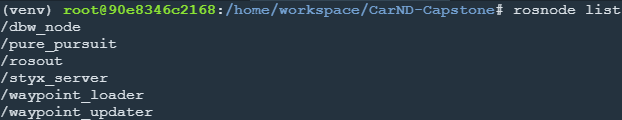
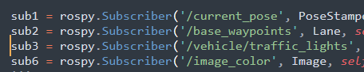
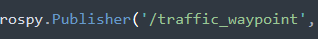
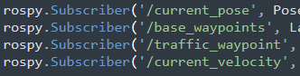
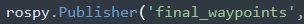
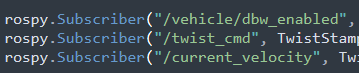
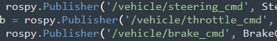

# Udacity Self-Driving Car Nanodegree: system integration

[](http://www.udacity.com/drive)

This is the project repo for the final project of the Udacity Self-Driving Car Nanodegree: Programming a Real Self-Driving Car. For more information about the project, see the project introduction [here](https://classroom.udacity.com/nanodegrees/nd013/parts/6047fe34-d93c-4f50-8336-b70ef10cb4b2/modules/e1a23b06-329a-4684-a717-ad476f0d8dff/lessons/462c933d-9f24-42d3-8bdc-a08a5fc866e4/concepts/5ab4b122-83e6-436d-850f-9f4d26627fd9).

Please use **one** of the two installation options, either native **or** docker installation.

### Result


## Overview

This repo template is refered from [Udacity-CarND-capstone-CarlaAI](https://github.com/williamhyin/Udacity-CarND-capstone-CarlaAI).

This repository contains the code for the final project of the [Udacity Self-Driving Car Nanodegree](https://www.udacity.com/course/self-driving-car-engineer-nanodegree--nd013): Programming a Real Self-Driving Car developed by the team **CarlaAI**.

Carla's system consists of a set of components implemented and deployed as [ROS](http://www.ros.org/) node and can be broken down into 3 main  sub-system:  ***Perception***, ***Planning*** and  ***Control***:


System Architecture (Picture From  [Udacity-CarND-capstone-CarlaAI](https://github.com/williamhyin/Udacity-CarND-capstone-CarlaAI))

Since Udacity already provides the basic execution framework, our team decided to focus on the implementation and integration of the following 3 nodes:

* [Traffic Light Detection](#traffic-light-detection): Part of the *perception* sub-system,  the node is responsible for detecting traffic lights as well as classifying their state.

* [Waypoint Updater](#waypoint-updater): Part of the *planning* sub-system, the node is responsible for generating trajectories (as a set of path points with their respective target speeds) considering the detected  traffic lights in the environment.

* [Drive by Wire Controller](#drive-by-wire-controller): Part of the *control* sub-system,  the node is responsible for translating the [Twist Messages](https://docs.ros.org/api/geometry_msgs/html/msg/Twist.html) generated by the [waypoint follower](./ros/src/waypoint_follower) into throttle, brake and steering values.

ROS Nodes
---
### ROS Nodes


ROS nodes


### [Traffic Light Detection](https://github.com/williamhyin/Udacity-Traffic-Light-Classification)

The [traffic light detection node](./ros/src/tl_detector) is in charge of  detecting incoming traffic lights and classifying their state.  If the status of an upcoming traffic light is classified as a red light, the detector calculates and publishes its position (waypoint index), so that the [waypoint updater](#waypoint-updater) can take the position of upcoming red light in generating a trajectory (accelerate, keep speed, slow down).

The node subscribes to 3-4 topics:

* **/base_waypoints:** The topic publishes the complete list of waypoints for the course. 
* **/current_pose:** The topic publishes the current position of the vehicle.
* **/image_color:** The topic publishes the RGB image stream from the car's camera. These images are used to determine the color of upcoming traffic lights.
* **/vehicle/traffic_lights:** The topic publishes the (x, y, z) coordinates of all traffic lights. (only in simulator).



Traffic light detection node

In this project I download the weight from below "Real world testing" and detect in RGB space with resize image to (300,300).
Unluckly there is some delay in my code that shows pass through the road and stop to wait green signal sometime, though it's just sometime.

## Note

I just followed the idea like below and code it in my mind logic.
And thanks again williamhyin for perfect repo template like below:
From  [Udacity-CarND-capstone-CarlaAI](https://github.com/williamhyin/Udacity-CarND-capstone-CarlaAI)

### Waypoint Updater

The waypoint updater node is responsible for generating a trajectory in terms of waypoints so that the [waypoint follower](./ros/src/waypoint_follower) can generate the correct [Twist Messages](https://docs.ros.org/api/geometry_msgs/html/msg/Twist.html) consumed by the [DBW Node](./ros/src/twist_controller/dbw_node.py). Each of the waypoints are generated from a subset of the overall set of waypoints provided according to the vehicle position (published in the `/current_pose` topic). For each waypoint a target velocity is generated to smoothen the transition between each waypoint.

The node also subscribes to the `/traffic_waypoint` topic published by the [Traffic Light Detection Node](#Traffic Light Detection) in order to adjust the waypoints in the presence of a red light:

Finally the node publishes the list of waypoints ahead of the vehicle to the `/final_waypoints` topic.




Waypoint_updater node

### Drive by Wire Controller

Udacity's self-driving car Carla is equipped with a drive-by-wire (DBW) system, which controls the throttle, brake, and steering electronically.

The goal for this part of the project is to implement the drive-by-wire node (`dbw_node.py`) which will subscribe to `/twist_cmd` and use various controllers to provide appropriate throttle, brake, and steering commands. The node subscribes to the `/current_velocity` topic along with the `/twist_cmd` topic to receive target linear and angular velocities (generated by the waypoint follower node from the waypoints published by the [waypoint updater](#waypoints-updater). The [DBW node](./ros/src/twist_controller/dbw_node.py) primarily defines the communication interface.  This node publishes throttle, brake, and steering commands to the `/vehicle/throttle_cmd`, `/vehicle/brake_cmd`, and `/vehicle/steering_cmd topics`.  The [twist_controller](./ros/src/twist_controller/twist_controller.py) contains the algorithms used to generate the control values.




DBW Controller node

The longitudinal control (throttle/brake) relies on the speed target generated by the waypoint updater node.  A [low pass filter](./ros/src/twist_controller/lowpass.py) is used to remove high-frequency noise from the measured vehicle velocity.

### Review

It was very difficult at first, but the Walkthrough in the lecture helped me a lot.
This gave me a lot of confidence and I was able to implement the vehicle system.
It was a really useful lecture and I think it's worth recommending it to someone else.
Thank you and peace!!!

### Native Installation

* Be sure that your workstation is running Ubuntu 16.04 Xenial Xerus or Ubuntu 14.04 Trusty Tahir. [Ubuntu downloads can be found here](https://www.ubuntu.com/download/desktop).
* If using a Virtual Machine to install Ubuntu, use the following configuration as minimum:
  * 2 CPU
  * 2 GB system memory
  * 25 GB of free hard drive space

  The Udacity provided virtual machine has ROS and Dataspeed DBW already installed, so you can skip the next two steps if you are using this.

* Follow these instructions to install ROS
  * [ROS Kinetic](http://wiki.ros.org/kinetic/Installation/Ubuntu) if you have Ubuntu 16.04.
  * [ROS Indigo](http://wiki.ros.org/indigo/Installation/Ubuntu) if you have Ubuntu 14.04.
* Download the [Udacity Simulator](https://github.com/udacity/CarND-Capstone/releases).

### Docker Installation
[Install Docker](https://docs.docker.com/engine/installation/)

Build the docker container
```bash
docker build . -t capstone
```

Run the docker file
```bash
docker run -p 4567:4567 -v $PWD:/capstone -v /tmp/log:/root/.ros/ --rm -it capstone
```

### Port Forwarding
To set up port forwarding, please refer to the "uWebSocketIO Starter Guide" found in the classroom (see Extended Kalman Filter Project lesson).

### Usage

1. Clone the project repository
```bash
git clone https://github.com/udacity/CarND-Capstone.git
```

2. Install python dependencies
```bash
cd CarND-Capstone
pip install -r requirements.txt
```
3. Make and run styx
```bash
cd ros
catkin_make
source devel/setup.sh
roslaunch launch/styx.launch
```
4. Run the simulator

### Real world testing
1. Download [training bag](https://s3-us-west-1.amazonaws.com/udacity-selfdrivingcar/traffic_light_bag_file.zip) that was recorded on the Udacity self-driving car.
2. Unzip the file
```bash
unzip traffic_light_bag_file.zip
```
3. Play the bag file
```bash
rosbag play -l traffic_light_bag_file/traffic_light_training.bag
```
4. Launch your project in site mode
```bash
cd CarND-Capstone/ros

roslaunch launch/site.launch

If it doesnt work, run both below

roslaunch launch/styx.launch
roslaunch launch/site.launch

```
5. Confirm that traffic light detection works on real life images

### used Tensorflow

I classify signals based on TensorFlow, detect signals with correct actions, and control the vehicle according to the signals.

Specific to these libraries, the simulator grader and Carla use the following:

|        | Simulator | Carla  |
| :-----------: |:-------------:| :-----:|
| Nvidia driver | 384.130 | 384.130 |
| CUDA | 8.0.61 | 8.0.61 |
| cuDNN | 6.0.21 | 6.0.21 |
| TensorRT | N/A | N/A |
| OpenCV | 3.2.0-dev | 2.4.8 |
| OpenMP | N/A | N/A |

We are working on a fix to line up the OpenCV versions between the two.


